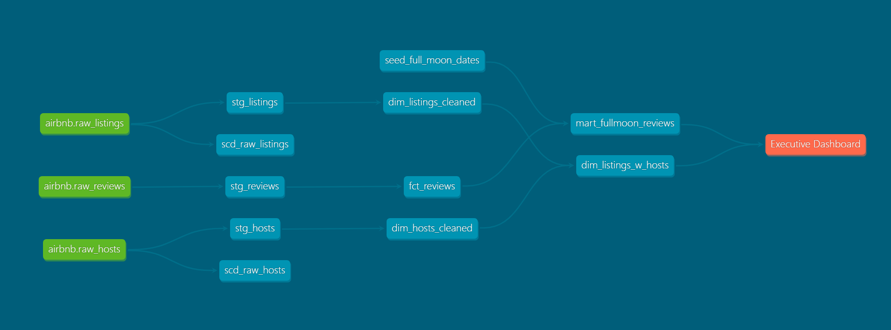
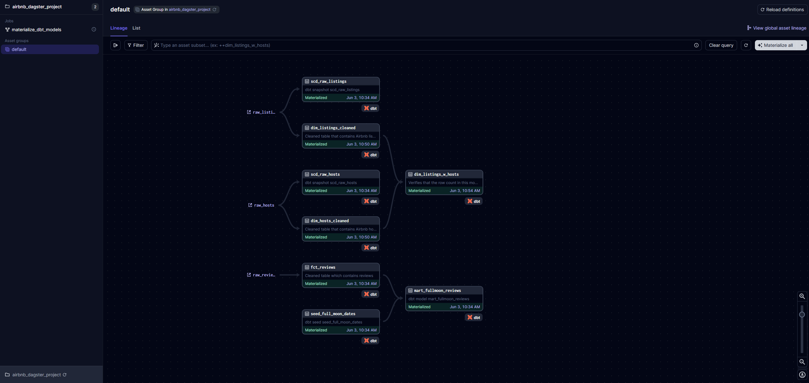

# Analytics Engineering with Airbnb Data

## Project Overview

This project simulates an end-to-end analytics engineering workflow using Airbnb data that focuses on listings, reviews, and hosts. Tools include dbt, Snowflake, Dagster, and Preset.

* **Data Ingestion:** Load raw Airbnb data from an Amazon S3 bucket into Snowflake
* **Transformation:** Model and transform data using dbt 
* **Visualization:** Create a simple dashboard using Preset 
* **Orchestration:** Manage the entire workflow with Dagster

## Data Model

 

## dbt DAG

 

## Dagster DAG

 

## Dashboard
